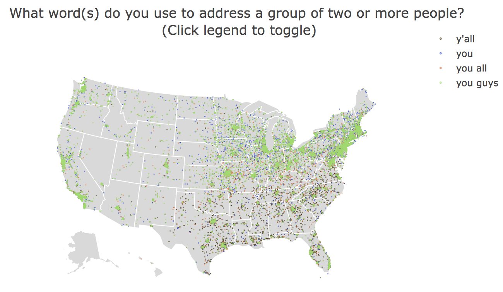
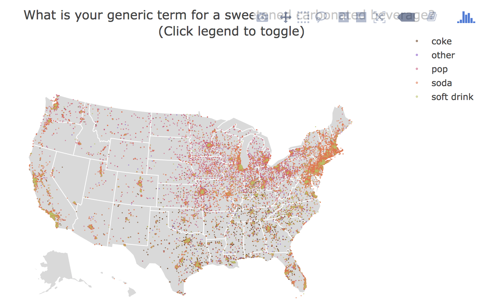
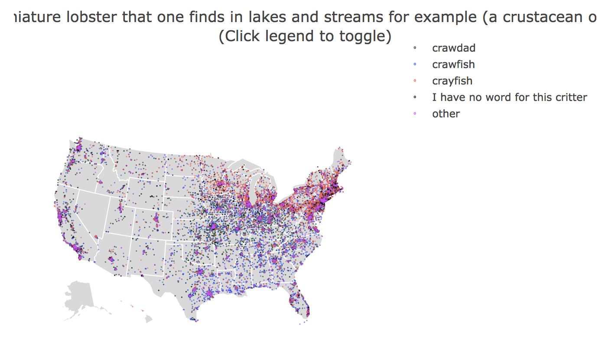
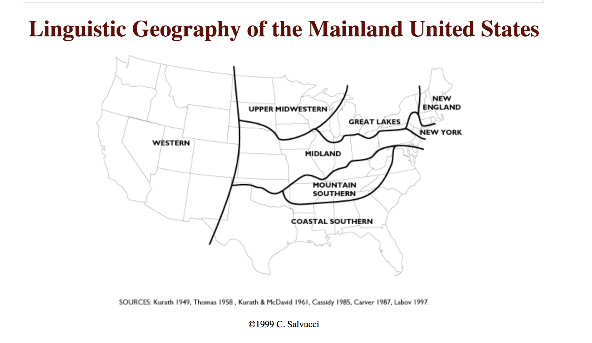
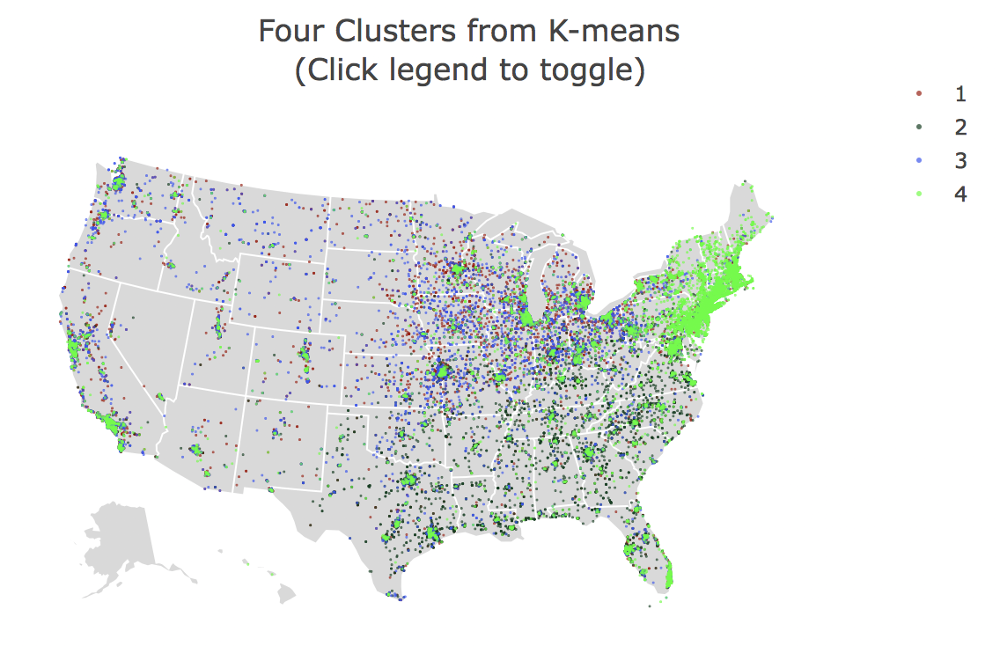
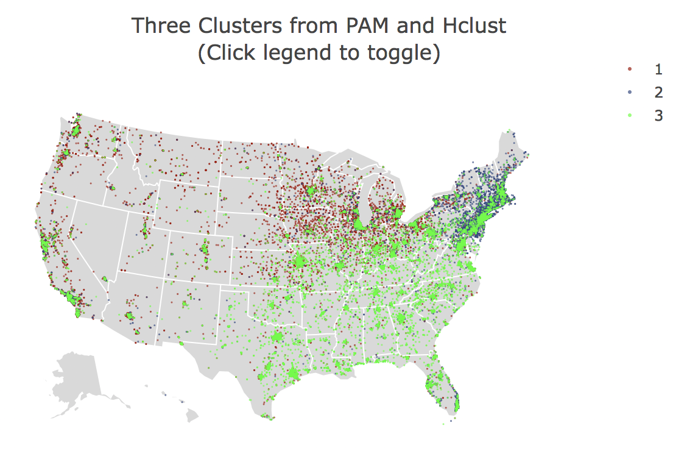

```{r setup, include=FALSE}
knitr::opts_chunk$set(echo = FALSE, message = FALSE, warning = FALSE, cache = TRUE, fig.pos = "H")

# load in useful packages
library(tidyverse)
library(gridExtra)
library(plotly)
library(DT)
library(reshape2)
library(lubridate)
library(devtools)
install_github("vqv/ggbiplot")
library(factoextra)
library(cluster)
library(fpc)
library(pander)
library(ggpubr)
library(knitr)
library(ggmap)

# load in the Kernel() functions
source("R/kernel.R")
# load in the loadData() functions
source("R/load.R")
# load in the theme_nice() function
source("R/utils.R")
# load in the plotExperiment() function
source("R/plot.R")
# load in the cleanData() functions
source("R/clean.R")
```

# Introduction

In the two-part paper, we will first tune parameters of kernel density plots and loess smoothing with the temperature and humidity of redwood dataset, and then dig into a project of linguistic data. 

In tuning paremeter part, data measures the temperature and humidity of redwood trees during a given time period. We experiment with different parameters while plotting the kernel density estimates of distribution of temperature, and while plotting a regression smoother to fit the relationship between temperature and humidity. After that, we illustrated the effect of parameters in our estimation as well as smoothing.

In the linguistic project, the data analyzed in the linguistic project was collected through a Dialect Survey online conducted by Bert Vaux. All the survey questions and each participants' answers are recorded in the survey, together with participants' geographical information including city, state, zipcode, latitude, and longitude. The purpose of the project is to explore potential association between linguistic features and geography. We start by analyzing whether the answers for individual survey question have connection with geography, and then we try to gain insight into all the survey questions simultaneously. Last but not least, we show some interesting finding and illustrate the stability of the finding.   


# Kernel Density Plots and Smoothing

```{r redwood-cleaning}
# load the dates data
dates.orig <- loadDatesData(path = "data/")
# clean the dates data
dates <- cleanDatesData(dates.orig)

# load the redwood sensor data
redwood.net.orig <- loadRedwoodData(path = "data/", source = "net")
redwood.log.orig <- loadRedwoodData(path = "data/", source = "log")
# clean the redwood sensor data
redwood.net <- cleanRedwoodData(redwood.net.orig)
redwood.log <- cleanRedwoodData(redwood.log.orig)

# load in the mote location data
mote.location <- loadMoteLocationData(path = "data/")

redwood.net <- redwood.net %>%
  # replace extra large voltage with NA, which takes 1% of the whole net data
  mutate(voltage = replace(voltage, voltage > 300, NA)) %>%
  # inner join the voltage between log and net data
  inner_join(redwood.log[, c("epoch", "nodeid", "voltage")], by = c("epoch", "nodeid"))

# calculate the intercept and slope of the fitted model
regression <- lm(voltage.y ~ voltage.x, redwood.net)

redwood.net <- redwood.net %>%
  # filter out abnormal log voltage below 2.4v
  mutate(voltage.y = replace(voltage.y, voltage.y < 2.4, NA)) %>%
  # fit voltage of net data from the least square model, which doesn't have corresponding log data
  mutate(voltage = case_when(!is.na(voltage.x) & is.na(voltage.y) ~ regression$fitted.values[voltage.x],
                             # transfer qualified log voltage data into net
                             !is.na(voltage.y) ~ voltage.y,
                             # remove disqualified log voltages
                             is.na(voltage.x) & is.na(voltage.y) ~ 0)) %>%
  #remove observations with disqualified voltage
  filter(voltage != 0) %>%
  # clean dummy column variables
  select(- c(voltage.x, voltage.y, date))
          
redwood.log <- redwood.log %>%
  filter(epoch < 8200) %>%
# filter out log data with extreme low voltage
  filter(voltage >= 2.4) %>%
  # clean dummy column variable
  select(-date)

redwood.all <- redwood.log %>%
  # combine the log and net data by row
  bind_rows(redwood.net) %>%
  # remove duplicates after combining two methods of retrieving data
  distinct()

# check if there is any different observations for the same node at the same time
all.sum <- redwood.all %>%
    # group rows by epoch and node id
    group_by(epoch, nodeid) %>%
    # count the number of the same nodes at the same time
    summarise(length = n()) %>%
    # filter rows which simultaneously observe the same nodes at the same time
    filter(length > 1)

redwood <- redwood.all %>%
  # remove observations with different network structure for the same node at the same time point
  anti_join(all.sum, by=c("epoch", "nodeid")) %>%
  # remove observation of node 122
  filter(nodeid !=  15 & nodeid != 100 & nodeid != 122) 

```


## Kernel Density Plots

To compare the effects of different kernels and bandwidths, we plot the density estimates of temperature of redwood dataset with a series bandwidths and different kernel functions (uniform kernel, Gaussian kernel, and triangular kernel). 

```{r density-plot-uniform, fig.cap = "\\label{fig:fig1}Uniform Kernel Density Estimate Of Temperature vs Bandwidth", fig.width = 6, fig.height = 4}
# Change Bandwidth when Kernel function is uniform function
unifkern <- lapply(c(0.1, 0.5, 1, 5, 10, 50), function(x){
  plot <- plotExperiment(UniformKern, width = x)
  plot +  ggtitle(paste("Uniform Kernel if Width =", x))})
grid.arrange(unifkern[[1]], unifkern[[2]],
             unifkern[[3]], unifkern[[4]],
             unifkern[[5]], unifkern[[6]],
             ncol = 2)
```

\ref{fig:fig1} is a plot of uniform kernel density estimates. When bandwidth is smaller, the plot of estimated density is more jagged. And the plot is smoother when bandwidth gets larger. However, if the bandwidth is too large, we can't portray the data very well because of excessive smoothing. 

```{r density-plot-gaussian, fig.cap = "\\label{fig:fig2}Gaussian Kernel Density Estimate Of Temperature vs Bandwidth", fig.width = 6, fig.height = 4}
# Change Bandwidth when Kernel function is Gaussian function
gausskern <- lapply(c(0.01, 0.1, 0.5, 1, 5, 10), function(x){
  plot <- plotExperiment(GaussianKern, width = x)
  plot + ggtitle(paste("Gaussian Kernel if Width =", x))})
grid.arrange(gausskern[[1]], gausskern[[2]],
             gausskern[[3]], gausskern[[4]],
             gausskern[[5]], gausskern[[6]],
             ncol = 2)
```

\ref{fig:fig2} is a plot of Gaussian kernel density estimates. We can still observe that the estimate is more smooth when the bandwidth increases, and the estimate is more jagged and doesn't show the trend of distribution very well when the bandwidth is smaller. The kernel density estimate is almost the same when bandwidth is 5 and 10, which indicates that there is no use in keeping increasing bandwidth when the density estimate is smooth enough.

```{r density-plot-triangular, fig.cap = "\\label{fig:fig3}Triangular Kernel Density Estimate Of Temperature vs Bandwidth", fig.width = 6, fig.height= 4}
# Change Bandwidth when Kernel function is triangular function
trikern <- lapply(c(0.1, 0.5, 1, 5, 10, 50), function(x){
  plot <- plotExperiment(TriangularKern, width = x)
  plot + ggtitle(paste("Triangular Kernel if Width =", x))})
grid.arrange(trikern[[1]], trikern[[2]],
             trikern[[3]], trikern[[4]],
             trikern[[5]], trikern[[6]],
             ncol = 2)
```

\ref{fig:fig3} is a plot of triangular kernel density estimates. The plot of kernel density estimate is rougher when the bandwith is smaller, and it is more smooth when the bandwidth is larger. It's almost impossible to extract distribution when bandwidth is 0.1 because the plot is too zigzagged. 

To compare among the three kernel functions, their estimated densities in general match with each other. A nice example to compare the three kernel functions would be when bandwidth is 1. The three estimated densities are almost the same, while the plot of Gaussian kernel is slightly more smooth, and the plot of triangular kernel is more jagged. 

To sum up, the choice of smoothing parameter is always more important than the choice of kernel functions. If the bandwidth or smoothing parameter is too small, our estimated density might have multiple false modes with a noiser plot. On the other hand, if the bandwidth is too large, we might throw away many important features of the observed distribution by smoothing. 


## Plot Smoother


```{r plot-smoother-degree-of-polynomials, fig.cap = "\\label{fig:fig4}Humidity vs Temperature Loess Smoother: Changing Degree of Polynomials", fig.width = 6, fig.height = 4}
# unique(redwood[redwood$epoch %% 288 == "227", "moment"])
# [1] 12:00:00

plotdp <- lapply(c(1, 2, 3, 4), function(dgr){
  redwood %>%
  filter(epoch %% 288 == 10) %>%
  ggplot() +
  geom_point(aes(x = humid_temp, y = humid_adj), alpha = 0.3, color = "#00A19B") +
  stat_smooth(aes(x = humid_temp, y = humid_adj), method='loess', color = "#FF6B6B", formula= y~poly(x, dgr), span=1) +
  theme_nice +
  xlab("temperature") +
  ylab("adjusted humidity") +
  ggtitle(paste0("degree =", dgr, ", bandwidth = 1")) +
  theme(axis.text=element_text(size=12),
    axis.title=element_text(size=14,face="bold"))
})

grid.arrange(plotdp[[1]], plotdp[[2]],
             plotdp[[3]], plotdp[[4]],
             ncol = 2)
```

```{r plot-smoother-bandwidth, fig.cap = "\\label{fig:fig5}Humidity vs Temperature Loess Smoother: Changing Bandwidth", fig.width = 6, fig.height = 4}

plotbw <- lapply(c(0.1, 0.5, 1, 2), function(sp){
  redwood %>%
  filter(epoch %% 288 == 10) %>%
  ggplot() +
  geom_point(aes(x = humid_temp, y = humid_adj), alpha = 0.3, color = "#00A19B") +
  stat_smooth(aes(x = humid_temp, y = humid_adj), method='loess', color = "#FF6B6B", formula= y~poly(x, 1), span = sp) +
  theme_nice +
  xlab("temperature") +
  ylab("adjusted humidity") +
  #ggtitle(paste0("bandwidth =", sp, ", degree = 1")) +
  theme(axis.text=element_text(size=12),
    axis.title=element_text(size=14,face="bold")) 
})
grid.arrange(plotbw[[1]], plotbw[[2]],
             plotbw[[3]], plotbw[[4]],
             ncol = 2)
```

We choose to plot the temperature versus humidity at noon (12:00:00) every day, and then add a loess smoother for regression. \ref{fig:fig4} shows the change of loess smoothers as the degree of polynomial varies, and \ref{fig:fig5} illustrates the change of loess smoothers when the bandwidth changes. From \ref{fig:fig4}, we know as degree goes larger, the model is more likely to overfit data. And the loess smoother fits better when n is 1 or 2. From \ref{fig:fig5}, we can see that as smoothing `span` or `bandwidth` changes, the accuracy of the fitted model also changes. As bandwidth is smaller, the degree of smoothing decreases, which leads to more noise and jagged lines. But if the bandwidth is above some thresholding, the loess smoother wouldn't vary much. 

```{r remove-redwood-data}
# Remove All Variables expect Functions in Global Environment
rm(list = setdiff(ls(), lsf.str()))
# reload in the theme_nice() function
source("R/utils.R")
```


# Linguistic Data


## Data Cleaning

```{r load-data}
# load pre-processed linguistic dataset
ling.data <- loadLingData(path = "data/")
ling.location <- loadLingLocation(path = "data/")
load("data/question_data.RData")
gc <- read.delim("extra/gc.txt")
```

All survey questions are contained in `quest.mat` in the file `question_data.Rdata`, and we only focus on `r nrow(quest.use)` questions about lexical differences rather than phonetic differences, which are contained in `quest.use`. All answer choices to the questions can be found in `all.ans`. And we have answers of 47,471 respondents across the United States in `ling.data`, together with their self-reported city, state, zipcode, corresponding latitude and longitude information. And there is another pre-processed dataset `lingLocation`, which turned categorical responses into binary data, and then clustered all answers from the same latitude and longtitude together.  

However, there are missing values in `ling.data`, and some participant-reported location is not in the United States. Below is a detailed description of data cleaning of `ling.data`. 

1. Fill up missing values

```{r missing-response}
# number of missing response for each individual
n.miss <- sapply(1:nrow(ling.data), function(x){sum(ling.data[x,] == 0)})
# percentage of respondents who missed at least one question
perc.miss <- sum(n.miss != 0)/ length(n.miss)
# remove those respondents who didn't answer over 60 questions
ling.data <- ling.data %>%
  filter(n.miss < 60)
```

The geographical information of 47,471 respondents across the United States is contained in `lingData`. To deal with missing values in longitude and latitude information, we geocode with dsk (Data Science Toolkit) to find longitude and latitude information based on the reported zipcode, city, and state. Another problem with missing data is that some respondents didn't answer all questions. There are `r perc.miss*100`% pariticipants didn't finish the whole survey. Among those who didn't answer at least one question, `r sum(n.miss>60)/sum(n.miss != 0)*100`% individuals didn't answer over 60 questions. These people couldn't offer enough information concerning their linguistic features because they have missed the majority of the questions. And they only take up `r sum(n.miss > 60)/nrow(ling.data)*100`% out of all survey participants. Thus, we decide to remove all information of the tiny portion of people because they can't offer any sufficent useful information for our linguistic analysis. At the same time, `r sum(n.miss<10 & n.miss>0)/sum(n.miss != 0)*100`% of individuals didn't answer at most 10 questions. Although they didn't answer all questions, but we still want to keep their submitted answers. In doing so, we denote those missing response as `0` in `ling.data`.  

```{r missing-value}
# add rowname as a column
ling.data$rname <- rownames(ling.data)
# index of all NA long 
index <- which(is.na(ling.data[, "long"]))
zip <- ling.data[index, c("ID", "CITY", "STATE", "ZIP", "long", "lat")]
# Geocode with Data Science Toolkit
#gc <- do.call(rbind,  
#            apply(zip, 1, function(x){geocode(location = paste(x[4], x[2], x[3], sep = ", "), 
#                                          source = "dsk")}))
gc[is.na(gc)] <- 0
gc$rname <- rownames(gc)  
ling.data <- ling.data %>%
  # merge two data frames
  left_join(gc, by = "rname") %>% 
  # coalesce two lat columns
  mutate(lat = coalesce(lat.x, lat.y)) %>%  
  # coalesce two long columns
  mutate(long = coalesce(long, lon)) %>%
  # remove columns with no use
  select(-c(lat.x, lat.y, lon))
```

2. Subset of a US map

There are `r length(unique(ling.data$STATE))` levels of state in our data, which exceeds the actual number of states in the United States. After looking through each state level, we find there are some reported states/location which is out of the United States, and some reported state information doesn't make sense, i.e. 94, N., M, etc. the abovementioned state information are either irrelevant or not trustworthy. Therefore, we decide to only include 48 states of the United States in our downstream analysis, excluding Alaska and Hawaii. Because there are only `r 542/nrow(ling.data) *100` % of respondents who have state information other than the 48 states in the United States, which is relatively small. 

```{r 48-states}
# exclude rows whose state is Alaska, Hawaii, or location outside of US
ling.data <- ling.data %>%
  filter(STATE %in% c("AL", "AZ", "AR", "CA", "CO", "CT", "DE", "FL", "GA", "ID", "IL", "IN", "IA", "KS", "KY", "LA", "ME", "MD", "MA", "MI", "MN", "MS", "MO", "MT", "NE", "NV", "NH", "NJ", "NM", "NY", "NC", "ND", "OH", "OK", "OR", "PA", "RI", "SC", "SD", "TN", "TX", "UT", "VT", "VA", "WA", "WV", "WI", "WY"))
```


## Investigation of Individual Survey Question


```{r major-answers-selection}
# Select major answers
# Question 50
tab50 <- table(ling.data[ling.data$Q050 != 0,]$Q050)
names(tab50) <- all.ans[[50]]$ans
pandoc.table(sort(tab50)[6:9], caption = "\\label{tab:tab1}Top Responses of Q50")
# filter out rows with no response in question 50
# only keep the top four responses for each question
data50 <- ling.data %>%
  filter(Q050 %in% c(1, 4, 7, 9))

# Question 66
tab66 <- table(ling.data[ling.data$Q066 != 0,]$Q066)
names(tab66) <- all.ans[[66]]$ans
pandoc.table(sort(tab66)[4:8], caption = "\\label{tab:tab2}Top Responses of Q66")
# filter out rows with no response in question 66
# only keep the top five responses for each question
data66 <- ling.data %>%
  filter(Q066 %in% c(1, 2, 5, 7, 8))

# Question 105
tab105 <- table(ling.data[ling.data$Q105 != 0,]$Q105)
names(tab105) <- all.ans[[105]]$ans
pandoc.table(sort(tab105)[4:8], caption = "\\label{tab:tab3}Top Responses of Q105")
# filter out rows with no response in question 105
# only keep the top five responses for each question
data105 <- ling.data %>%
  filter(Q105 %in% c(1, 2, 3, 5, 10))
```

We pick some survey questions and plot the major answers of each question in a US map. Individuals with no response for the question will be excluded from the map. For the sake of clear visualization and less variability, we decide to only adopt top responses in the linguistic map so that we'll be more likely to get distinct geographical groups. The accuracy and objectivity of the data points will not be affected, as only a merely neglectable portion of data is excluded. \ref{tab:tab1} shows the sorted responses of question 50, and the top four responses take up `r sum(sort(tab50)[6:9])/nrow(ling.data) *100`% of all the data, which represents the data pretty well. \ref{tab:tab2} shows the sorted responses of question 66, and the top five responses take up `r sum(sort(tab66)[4:8])/nrow(ling.data) *100`% of all the data. \ref{tab:tab3} is the sorted responses of question 105, and `r sum(sort(tab66)[4:8])/nrow(ling.data) *100`% of the data is represented by the top five responses. Therefore, data quality is guaranteed as we reserve 93-96% of the data information.

Below are linguistic map plots of question 50, 60, and 105. These plots are user-interactive bubble maps (plz refer to the html webpage). Each data point represents a response from one respondent. There are some interactive functions user might be interested in exploring: 

1. The response and city of the respondent will pop up if user puts the cursor over some data point. 
2. Users may double click the legend to filter answers in the map.  Specifically, the corresponding group of answers will disappear from the map if some legend name turns dim. In that way, users can better distinguish between different answers and explore their own interested answers for each question.
3. Users may zoom in or zoom out to observe the distribution of answers for one specific geographical district. 

```{r quest50, fig.cap = "\\label{fig:fig6}Grographical Distribution of Survey Question No. 50", out.width = '60%'}
# draw a skeleton of US map
g <- list(
  scope = 'usa',
  projection = list(type = 'albers usa'),
  showland = TRUE,
  landcolor = toRGB("gray85"),
  subunitwidth = 1,
  countrywidth = 1,
  subunitcolor = toRGB("white"),
  countrycolor = toRGB("white")
)

# add data points of each correspondent
p1 <- plot_geo(data50, locationmode = 'USA-states', sizes = c(1, 250)) %>%
  add_markers(x = ~long, y = ~lat, 
    colors = c("#A30A00", "#003E1F", "#3B53F3", "#F75842", "#11FD6C", "#030F1C"),
    color = ~all.ans[[50]]$ans[data50$Q050], 
    text =~paste(all.ans[[50]]$ans[data50$Q050], "<br />", data50$CITY), 
    hoverinfo = 'text', 
    alpha = 0.5, 
    marker = list(size=rep(0.2, nrow(data50)), sizemode="area", showlegend = T)) %>%
  layout(title = paste(quest.mat$quest[50], '<br>(Click legend to toggle)'), geo = g, autosize = F, margin(l = 0, r = 0, t = 0, b = 0))
# plot

```

```{r quest105, fig.cap = "\\label{fig:fig7}Grographical Distribution of Survey Question No. 105", out.width = '60%'}

# add data points of each correspondent
p2 <- plot_geo(data105, locationmode = 'USA-states', sizes = c(1, 250)) %>%
  add_markers(x = ~long, y = ~lat, 
    colors = c("#A30A00", "#003E1F", "#3B53F3", "#F75842", "#11FD6C"),
    color = ~all.ans[[105]]$ans[data105$Q105], 
    text =~paste(all.ans[[105]]$ans[data105$Q105], "<br />", data105$CITY), 
    hoverinfo = 'text', 
    alpha = 0.3, 
    marker = list(size=rep(0.2, nrow(data105)), sizemode="area", showlegend = T)) %>%
  layout(title = paste(quest.mat$quest[105], '<br>(Click legend to toggle)'), geo = g,  margin = list(l = 1, r = 0, b = 1, t = 30, pad = 0))
# plot

```

```{r quest66, fig.cap = "\\label{fig:fig8}Grographical Distribution of Survey Question No. 66", out.width = '80%'}

# add data points of each correspondent
p3 <- plot_geo(data66, locationmode = 'USA-states', sizes = c(1, 250)) %>%
  add_markers(x = ~long, y = ~lat, 
    colors = c("#A30A00", "#003E1F", "#3B53F3", "#F75842", "#11FD6C", "#030F1C", "#030F1C", "#D544F7"),
    color = ~all.ans[[66]]$ans[data66$Q066], 
    text =~paste(all.ans[[66]]$ans[data66$Q066], "<br />", data66$CITY), 
    hoverinfo = 'text', 
    alpha = 0.3, 
    marker = list(size=rep(0.2, nrow(data66)), sizemode="area", showlegend = T)) %>%
  layout(title = paste(quest.mat$quest[66], '<br>(Click legend to toggle)'), geo = g,  margin = list(l = 1, r = 0, b = 1, t = 30, pad = 0))
# plot

```

We first notice data points in all linguistic maps are not evenly distributed among the United States. Most individuals taken the survey live in the northeast part, and New York in particular.  On the contrary, data points in west side are quite sparse, and there are only some clusters near the coast of California. We need to bear the unbiasness in mind, because the absolute number of data points can''t decide geographical groups. We can only declare some answer choices have a geographical group when the relative amount of individuals choosing the answer is still large compared with the overall number of individuals within that region. 

\ref{fig:fig6} explores the distribution of answers in question 50. The answer of 'y'all' is mostly in the southeast (coastal southern and mountain southern) area, whereas 'you guys' takes up the northern and western part. Comparing it with \ref{fig:fig7} in question 105, the answer of 'coke' is mainly around the southest part, and the southeast part is roughly dominated by 'coke' too. In that way, we may define the southeast side as one distinct geographical group defined by question 50 and 105. If someone answers 'y'all', we can reasonably state that this person is very likely to be into brand quality, and refer a sweetened carbonated beverage as `coke`. And vice versa. From \ref{fig:fig7}, we can see answers with 'soda' are most clustered in New York area, and answers with `pop` are mainly in the north side (great lakes, and upper midwestern area). Interestingly, the answers of 'crayfish' in question 66 from \ref{fig:fig8} are also around the northeast side (great lakes, upper midwestern, and New York area). Thus, we may define another distinct geographical group in the northeast side. And we may seperate New York area as one distinct region too. If someone picks 'crayfish' as the answer which is in the northeast side of US, we predict there is higher probability that this person would refer `pop` as a sweetened carbonated beverage. Besides that, we don't have further concrete evidence to identify geographical groups or predict. Next, we will try to gain some insight from the whole dataset with all questions, and see if we could have stronger evidence for clustering.


## 2. Dimension Reduction with Binary Data

We first convert categorical data of the full dataset into binary data, i.e. each column represents an answer choice for some question. If one respondent chooses some answer, then the corresponding number for the person and choice is 1, otherwise 0. And then we perform principle component analysis (PCA) on both  `ling.bin` (binary data converted from `ling.data`) and `ling.location`, to compare which does a better job in explaining the variance, or give better clustering result. We decide not to rescale the binary data because we are more interested in the difference between two categories 0 and 1, and it is improper to treat discrete 0/1 in any way as continuous. If someone doesn't respond to one question, the vector encoded in `ling.bin` will be all 0 and we will not take no response as one separated level. For example, suppose John answered all questions except for the first one, and the first question has 4 choices, then ling.bin would encode (0, 0, 0, 0, ...). 

```{r binary}
# convert multiple columns into factor
ling.data[5:71] <- lapply(ling.data[5:71], factor)
# Encode the categorical response into binary
ling.bin <- model.matrix(~ . + 0, data = ling.data[-c(1, 2, 3, 4, 72, 73, 74)], contrasts.arg = lapply(ling.data[5:71], contrasts, contrasts = FALSE))
# find all columns with 0 as a new level
drop.cols <- c("Q0500", "Q0510", "Q0520", "Q0530", "Q0540", "Q0550", "Q0560", "Q0570", "Q0580", "Q0590", "Q0600", "Q0610", "Q0620", "Q0630", "Q0640", "Q0650", "Q0660", "Q0670", "Q0680", "Q0690", "Q0700", "Q0710", "Q0720", "Q0730", "Q0740", "Q0750", "Q0760", "Q0770", "Q0780", "Q0790", "Q0800", "Q0810", "Q0820", "Q0830", "Q0840", "Q0850", "Q0860", "Q0870", "Q0880", "Q0890", "Q0900", "Q0910", "Q0920", "Q0930", "Q0940", "Q0950", "Q0960", "Q0970", "Q0980", "Q0990", "Q1000", "Q1010", "Q1020", "Q1030", "Q1040", "Q1050", "Q1060", "Q1070", "Q1090", "Q1100", "Q1110", "Q1150", "Q1170", "Q1180", "Q1190",  "Q1200", "Q1210")
# convert matrix into data.frame
ling.bin <- as.data.frame(ling.bin)
# remove all columns with 0 as a new level
ling.bin <- ling.bin %>%
  select(-(drop.cols))

# dim(ling.bin) = [46929, 468]
# dim(ling.data) = [46929, 74]
```

```{r dimension-reduction-pca-lingdata, fig.cap = "\\label{fig:fig9}Plots of Ordered Eigenvalues of ling.data", fig.width = 3, fig.height = 2}
# Principal Component Analysis
pc.bin <- prcomp(ling.bin, scale = FALSE)
# plot of eigenvalues ordered from largest to the smallest
fviz_eig(pc.bin, addlabels = TRUE, ylim = c(0, 5))
```

```{r linguistic-geography, fig.cap="\\label{fig:fig10}Linguistic Geography of US (Domain Knowledge)", out.width = '50%'}

ling.data <- ling.data %>%
  mutate(region = ifelse(STATE %in% c("WA", "OR", "CA", "NV", "MT", "ID", "WY", "UT", "CO", "NM", "AZ"), "Western",
                            ifelse(STATE %in% c("ND", "SD", "MN", "WI", "IA"),"Upper Midwestern",
                            ifelse(STATE %in% c("NE", "IL", "MO", "KS", "IN", "OH", "PA"), "midland",
                            ifelse(STATE %in% c("NJ", "DE"), "New York", 
                            ifelse(STATE %in% c("MI", "NY"),"Great Lake", 
                            ifelse(STATE %in% c("VT", "NH", "ME", "MA", "RI", "CT", "MD", "DC"), "New England",
                            ifelse(STATE %in% c("AR", "TN", "KY", "WV"), "Mountain Southern",
                            ifelse(STATE %in% c("OK", "TX", "LA", "MS", "AL", "GA", "FL", "SC", "NC", "VA"), "Coastal Southern", "Other")))))))))
region <- as.factor(ling.data$region)
```

```{r clustering1, fig.cap = "\\label{fig:fig11}Linguistic Data Projected on Different PC Spaces", fig.width = 6, fig.height = 4}
# define a function for plotting
plotLabeledData <- function(x, y, labels=NULL) {
  # Plot labeled data along two axes
  # Args:
  #   x: observation values for the first axis to plot over
  #   y: observation values for the second axis to plot over
  #   labels: factor giving the label of each point
  plotting.data <- data.frame(X = x, Y = y, region = labels)
  p <- ggplot(plotting.data) + 
    geom_point(aes(x = X, y = Y, color = region), size = 0.005)
  return(p)
}
# plot pca results on PC2 vs PC1
p.bin12 <- plotLabeledData(pc.bin$x[, 1], pc.bin$x[, 2],
  labels = region) +
  ggtitle("Clusters on PC2 vs PC1") +
  xlab("PC1") + 
  ylab("PC2") +
  theme(axis.text=element_text(size=10),
        axis.title=element_text(size=12,face="bold"))

# plot pca results on PC3 vs PC1
p.bin13 <- plotLabeledData(pc.bin$x[, 1], pc.bin$x[, 3], 
  labels = region)  +
  ggtitle("Clusters on PC3 vs PC1") +
  xlab("PC1") + 
  ylab("PC3") +
  theme(axis.text=element_text(size=10),
        axis.title=element_text(size=12,face="bold"))

# plot pca results on PC3 vs PC2
p.bin23 <- plotLabeledData(pc.bin$x[, 2], pc.bin$x[, 3], 
  labels = region)  +
  ggtitle("Clusters on PC3 vs PC2") +
  xlab("PC2") + 
  ylab("PC3") +
  theme(axis.text=element_text(size=10),
        axis.title=element_text(size=12,face="bold"))

# plot pca results on PC4 vs PC1
p.bin14 <- plotLabeledData(pc.bin$x[, 1], pc.bin$x[, 4], 
  labels = region)  +
  ggtitle("Clusters on PC4 vs PC1") +
  xlab("PC1") + 
  ylab("PC4") +
  theme(axis.text=element_text(size=10),
        axis.title=element_text(size=12,face="bold"))

g_legend<-function(a.gplot){
  tmp <- ggplot_gtable(ggplot_build(a.gplot))
  leg <- which(sapply(tmp$grobs, function(x) x$name) == "guide-box")
  legend <- tmp$grobs[[leg]]
  return(legend)}

mylegend<-g_legend(p.bin12)

grid.arrange(arrangeGrob(p.bin12 + theme(legend.position="none"),
                         p.bin13 + theme(legend.position="none"),
                         p.bin23 + theme(legend.position="none"),
                         p.bin14 + theme(legend.position="none"),
                         nrow=2),
             mylegend, nrow=2,heights=c(5, 1))
```

\ref{fig:fig9} is the Screeplot showing the eigenvalues of binary linguistic data for each dimension ordered from largest to the smallest. Top 5 dimensions give us 15.2% of explained variance, and top 10 give 23.2%. Hence we would need too many dimensions to represent the full variability in ling.bin, and top 2 dimensions is not representing data well at all. For instance, in \ref{fig:fig11} we try to plot the binary linguistic data onto different projections in PCA. Data points in different colors represent individuals in different regions. According to our domain knowledge, Salvucci et al. (\ref{fig:fig10}) defined seven linguistic regions of the United States by their knowledge in linguistics. They are Western, Upper Midwestern, Great Lakes, Midland, New York, New England, Mountain Southern, and Coastal Southern regions. We will classify all individuals into those regions by their state information. And people in Alaska and Hawaii will be a unique linguistic region because people there don't share linguitic customs with others. \ref{fig:fig11} shows the binary data projected onto different pairs of components, labeled by region. We can see that the projection of PC2 vs PC1 give us the relatively nice clusters with respect to regions. However, we can still see severe mixing between different labels/colors, and there are only 3 clusters being separated in the dense tangle of data points. That's most likely because the number of cluster we specify is too large for our dataset, i.e. there are only less than 7 different linguistic clusters in data set, thus we decide to try to find the optimal number of clustering first. 

```{r dimension-reduction-pca-linglocation, fig.cap = "\\label{fig:fig12}Plots of Ordered Eigenvalues of ling.location", fig.width = 3, fig.height = 2}
# Principal Component Analysis
pc.loc <- prcomp(ling.location[-(1:3)], scale = TRUE)
# plot of eigenvalues ordered from largest to the smallest
fviz_eig(pc.loc, addlabels = TRUE, ylim = c(0, 70))
```

```{r dimension-reduction-pca-linglocation-cont, fig.cap = "\\label{fig:fig13}Re-projection of Components for ling.location", fig.width = 5, fig.height = 3.5}
pc.sum <- (pc.bin$sdev)^2 / sum((pc.bin$sdev)^2) *100
# plot of PCA
plot.loc1 <- ggplot(data.frame(X = pc.loc$x[, 1], Y = pc.loc$x[, 2])) + geom_point(aes(x = X, y = Y), size = 0.3, color = "darkred") + ggtitle("PC2 versus PC1") + theme(axis.text=element_text(size=12), axis.title=element_text(size=14,face="bold")) + theme_nice
plot.loc2 <- ggplot(data.frame(X = pc.loc$x[, 3], Y = pc.loc$x[, 1])) + geom_point(aes(x = X, y = Y), size = 0.3, color = "darkred") + ggtitle("PC3 versus PC1") + theme(axis.text=element_text(size=12), axis.title=element_text(size=14,face="bold")) + theme_nice
plot.loc3 <- ggplot(data.frame(X = pc.loc$x[, 4], Y = pc.loc$x[, 1])) + geom_point(aes(x = X, y = Y), size = 0.3, color = "darkred") + ggtitle("PC4 versus PC1") + theme(axis.text=element_text(size=12), axis.title=element_text(size=14,face="bold")) + theme_nice
plot.loc4 <- ggplot(data.frame(X = pc.loc$x[, 3], Y = pc.loc$x[, 2])) + geom_point(aes(x = X, y = Y), size = 0.3, color = "darkred") + ggtitle("PC3 versus PC2") + theme(axis.text=element_text(size=12), axis.title=element_text(size=14,face="bold")) + theme_nice

grid.arrange(plot.loc1, plot.loc2,
             plot.loc3, plot.loc4,
             ncol = 2)
```

Another potential problem with PCA plots of binary `ling.data` is that all data points are jumbled together. And the top PCs can't explain the variance very well. So we perform PCA on `ling.location` as well, and see if it would make a difference. The dimension of `ling.location` is [`r nrow(ling.location)`, `r ncol(ling.location)-3`], so it is not as sparse as binary `ling.data`. From the Scree plot \ref{fig:fig12}, we can see the first component explains 63.8% of the variance, and the second component explains 5% of the variance. The top two components can do a much better job in explaining the variance and represent the data compared with binary `ling.data`. \ref{fig:fig13} shows different projections of `ling.location` data. We can better visualize data from \ref{fig:fig13} with respect to isolate geographical groups, because data points are much more spread out now. Each data point in \ref{fig:fig13} represents all individuals of the same longitude and latitude, and we don't care about the within-group difference for all individuals. 


## 3. Clustering Analysis to Isolate Geographical Groups

We're going to apply three different clustering methods, and compare their results to see if we can find the optimal number of clusters. The first method is to apply k-means on the major PCs, the second method is to perform Partitioning Around Medoid (PAM), and the third method is hierarchical clustering. We're interested in comparing the different effects of these methods, and we hope to isolate distinct geographical groups via the clustering methods. 


### K-means and Elbow Method

```{r elbow-method-loc}
# Elbow method to decide the optimal k for k-means
k.max <- 15
wss.loc <- sapply(1:k.max, 
              function(k){kmeans(ling.location, k, nstart=50, iter.max = 15 )$tot.withinss})
#plot(1:k.max, wss.loc,
#     type="b", pch = 19, frame = FALSE, 
#     xlab="Number of clusters K",
#     ylab="Total within-clusters sum of squares", cex.lab = 1.3, cex.axis =  1.3, cex.main = 1.3)
#abline(v = 4, col = "red", lwd = 3, lty = "dotted")
```

```{r}
# cluster linguistic location data in original and PC spaces and plot along the major PCs
k.em <- 4
# k-means using all variables
kmeans.loc.raw <- kmeans(scale(ling.location), centers = k.em)
# spectral clustering using first 100 PCs for binary data
kmeans.bin.reduced <- kmeans(pc.bin$x[, 1:100], centers = k.em)
```

```{r reconstruction-map, fig.cap = "\\label{fig:fig15}Survey Takers Are Labeled by Their Clusters k = 4", out.width = '80%'}
# map the 4 clusters back to the map, and the size of each bubble is decided by the number of people 
map1 <- plot_geo(ling.data, locationmode = 'USA-states', sizes = c(1, 250)) %>%
  add_markers(x = ~long, y = ~lat, 
    colors = c("#A30A00", "#003E1F", "#3B53F3", "green"),
    color = ~as.factor(kmeans.bin.reduced$cluster), 
    text =~paste("Cluster ", as.factor(kmeans.bin.reduced$cluster), "<br />", data105$CITY), 
    hoverinfo = 'text', 
    alpha = 1,
    marker = list(size = rep(0.2, nrow(ling.data)), sizemode="area", showlegend = T)) %>%
  layout(title = 'Four Clusters from K-means<br>(Click legend to toggle)', geo = g,  margin = list(l = 1, r = 0, b = 1, t = 30, pad = 0))
# plot

```

We first try to perform K means on the projection of top PCs. We decide to pick the top 100 PCs, because the top 100 PCs explain `r sum(pc.sum[1:50])`% of the variance, which is trustworthy to represent the whole set. And then we tried to use the Elbow Method to find the optimal number of clustering K. For computational efficiency, we will look for the optimal K by using `ling.location`. Because the optimal clusters `ling.location` and `ling.data` give us will surely make no difference. The elbow method figure shows that k = 4 would be the optimal number of clusters given Elbow Method. Then we separate `ling.data` into 4 clusters by K-means, and label each individual as one cluster. It can help us to reconstruct the US map with the labeling of everyone's cluster. We can clearly see 3 clusters from \ref{fig:fig15}: cluster 1 on the northeast side including New York, cluster 3 on the south side of US, and cluster 4 on the Upper Midwestern, and western area. It's worth noting that data points which belong to cluster 2 are sparsely spreaded acorss the mainland, thus cluster 2 a redundant cluster in real life. 


### Multidimensional Scaling and PAM

```{r dimension-reduction-mds, fig.cap = "\\label{fig:fig16}Dimension Reduction Using Multidimensional Scaling", fig.width = 4, fig.height = 3}
# Multidimensional Scaling
## Calculate the Euclidean matrix of linguistic data
ling.loc <- ling.location[-(1:3)]
# convert all non-zero values to 1
ling.loc[ling.loc != 0] <- 1
dist.loc <- as.matrix(dist(t(ling.loc)), method = "euclidean")

## Perform Multidimensional Scaling
mds <- cmdscale(dist.loc, k=2)
plot(mds[,1], mds[,2], type = "n", xlab = "Dimension One", ylab = "Dimension 2",
     main = "Dataset Structure after Multidimensional Scaling", cex = 0.1)
text(mds[,1], mds[,2], labels(dist.loc)[[1]], cex = 0.9, xpd = TRUE)
```

```{r silhouette, fig.cap = "\\label{fig:fig17}Average Silhouette Length vs Number of Clusters", fig.width = 5, fig.height = 3}
# Average silhouette widths for PAM with K = 2, ..., 15 clusters
K <- 2:15
avgSil <- rep(NA, length(K))
names(avgSil) <- K
for(k in K){
avgSil[k-1] <- pam(mds, k=k)$silinfo$avg.width}

# Graphical summaries
barplot(avgSil, names.arg = K, xlab = "Number of clusters, K", ylab = "Average silhouette", main = "Determine the Optimal K", cex.lab = 1.5, cex.axis =  1.5, cex.main = 1.5) 
```

```{r fpc3, fig.cap = "\\label{fig:fig18}Silhouette Plot with 3 Clusters", fig.width = 6, fig.height = 4}
pam.res3 <- pam(mds, 3)
par(mfrow=c(1,2))
clusplot(pam.res3, main = "Cluster plot, k = 3", 
         color = TRUE, cex.lab = 1.5, cex.axis =  1.5, cex.main = 1.5)
plot(silhouette(pam.res3),  col = c("#D00000", "#9E2387", "#0037AF")) 
abline(v = pam.res3$silinfo[[3]], col = "red", lwd = 3, lty = "dotted")
```

We first try another dimension reduction technique, called multidimensional scaling (MDS). And then we perform PAM on the reduced dataset. To calculate MDS, we first convert all non-zero counts in `ling.location` into 1, and then calculate the Euclidean matrix of the data. We perform multidimensional scaling based on the distance matrix, and get a dataset structure which is similar to a quadratic line in \ref{fig:fig16}. We then calculate the average silhouette width for different number of clusters to find the optimal k. And we'll get the maximized average silhouette width when the number of clusters is 3, according to \ref{fig:fig17}. We plot the silhouette graph when k = 3 in the right figure of \ref{fig:fig17}, and we can clearly see that the height of each block is almost the same, and every silhouette width is all above the average silhouette width. That's the reason why we choose k = 3 in this case.


### Hierarchical Clustering

```{r hierarchical-clustering, fig.cap = "\\label{fig:fig19}Dendrogram of Agnes", fig.width = 6, fig.height = 4}
# hierarchical clustering
hc <- agnes(t(ling.location[-(1:3)]), method = "ward")
pltree(hc, cex = 0.6, hang = -1, main = "Dendrogram of agnes") 
rect.hclust(hc, k = 3, border = 2:5)
```

```{r hierarchical-clustering-cont, fig.cap = "\\label{fig:fig20}Cluster Plot of Hierarchical Clustering", fig.width = 6, fig.height = 4}
sub_grp <- cutree(hc, k = 3)
fviz_cluster(list(data = t(ling.location[-(1:3)]), cluster = sub_grp))
```

```{r reconstruction-map1, fig.cap = "\\label{fig:fig21}Survey Takers Are Labeled by Their Clusters, k=3", out.width = '80%'}
# spectral clustering using first 100 PCs for binary data
kmeans.bin.reduced1 <- kmeans(pc.bin$x[, 1:100], centers = 3)
# map the 4 clusters back to the map, and the size of each bubble is decided by the number of people 
map2 <- plot_geo(ling.data, locationmode = 'USA-states', sizes = c(1, 250)) %>%
  add_markers(x = ~long, y = ~lat, 
    colors = c("#A30A00", "#003E1F", "#3B53F3", "green"),
    color = ~as.factor(kmeans.bin.reduced1$cluster), 
    text =~paste("Cluster ", as.factor(kmeans.bin.reduced1$cluster)), 
    hoverinfo = 'text', 
    alpha = 1,
    marker = list(size = rep(0.2, nrow(ling.data)), sizemode="area", showlegend = T)) %>%
  layout(title = 'Three Clusters from PAM and Hclust<br>(Click legend to toggle)', geo = g,  margin = list(l = 1, r = 0, b = 1, t = 30, pad = 0))
# plot

```

We all agree that dialects would be differentiated in smaller regions, and the dialects will have more similarity in larger neighborhood. For instance, people might either speak French or English in some country, and those who speak English either speak American English or British English. Those who speak American English will also have their own dialect differences. This kind of hierarchical structure of linguistic data suggest us to explore hierarchical clustering. And we apply Ward's method to draw the dendrogram of agnes first. And we also mark three different clusters in \ref{fig:fig19} in red, green, and blue. \ref{fig:fig20} is a cluster plot to show 3 clusters of ling.location data after we perform hierarchical clustering. 

```{r contribution, fig.cap="\\label{fig:fig22}Contribution of Variables to Dim 1 and 2", fig.width = 4, fig.height = 3}
# which variables contribute most to the first two principal components?
ling.data1 <- sapply(ling.data[5:71], as.numeric)
pc.cat <- prcomp(ling.data1, scale = TRUE)
fviz_contrib(pc.cat, choice = "var", axes = 1:2)
```

Thus, we know the optimal number of cluster is either 3 or 4 according to the abovementioned clustering methods. Comparing between \ref{fig:fig15} and \ref{fig:fig21}, we know that when the number of clustering is 3, we would have less mixing between clusters. Since the boundaries of three clusters are much more clear and obvious, we decide to adopt the number of clusters as 3, and use \ref{fig:fig21} as the clustering of the whole dataset. And there is continuum especially at the northeast side of US, specifically New Jersey, Connecticut, Rhode Island, and "the City" New York. By continuum, we refer to the fact that the clusters are highly mixed up there, and it's difficult to distinguish the boundaries of the clusters. By \ref{fig:fig22}, we know the question that explains the most variance to dimension 1 and 2 is question 54: `r quest.use[quest.use$qnum == 54,"quest"]`. And question 54 is the question that produce the continuum because it causes the most variance/ 'noise' to the projection on the first two components.  


## Stability Analysis

We can either do algorithm perturbation (i.e. changing the starting points of k-means), or do data perturbation (i.e. subsample or bootstramp). Here we give example of algorithm and data perturbation and show that the clustering is stable when number of cluster is 4.
(Note: Given time constraint, I can't output the plot. But the codes are here for your reference.)

```{r k3, message=FALSE, fig.cap="\\label{fig:fig23}Cluster labels using k=3"}
# run spectral clustering 4 times with 3 centers
kmeans.3 <- lapply(1:4, function(k) {
    kmeans(pc.bin$x[, 1:100], centers = 3)
  })
# plot the resulting clusters from each run of spectral clustering
clusters <- lapply(kmeans.3, function(km) {
map <- plot_geo(ling.data, locationmode = 'USA-states', sizes = c(1, 250)) %>%
  add_markers(x = ~long, y = ~lat, 
    colors = c("#A30A00", "#003E1F", "#3B53F3", "green"),
    color = ~as.factor(km$cluster), 
    text =~paste("Cluster ", as.factor(km$cluster)), 
    hoverinfo = 'text', 
    alpha = 1,
    marker = list(size = rep(0.2, nrow(ling.data)), sizemode="area", showlegend = T)) %>%
  layout(title = paste('Three Clusters <br>(Click legend to toggle)', geo = g,  margin = list(l = 1, r = 0, b = 1, t = 30, pad = 0)))
})
p <-subplot(clusters[[1]], clusters[[2]],
             clusters[[3]], clusters[[4]])
#p
```

```{r robustness, fig.cap="\\label{fig:fig24}Subsample Clustering. Top left: 5000; Top right: 8000; Bottom left: 10000; Bottom right: original", eval = F}
# sample without replacement
sample5000 <- ling.data[sample(1:nrow(ling.data), 5000,
  	replace=FALSE),]
sample8000 <- ling.data[sample(1:nrow(ling.data), 8000,
  	replace=FALSE),]
sample10000 <- ling.data[sample(1:nrow(ling.data), 10000,
  	replace=FALSE),]
# Principal Component Analysis
sample5000[5:71]<-sapply(sample5000[5:71], as.numeric)
pc.5000 <- prcomp(sample5000[5:71], scale = T)
# spectral clustering using first 2 PCs for binary data
kmeans.5000.reduced <- kmeans(pc.5000$x[, 1:2], centers = 4)

samp1 <- plot_geo(sample5000, locationmode = 'USA-states', sizes = c(1, 250)) %>%
  add_markers(x = ~long, y = ~lat, 
    colors = c("#A30A00", "#003E1F", "#3B53F3", "#F75842", "#11FD6C", "#030F1C", "#030F1C", "#D544F7"),
    color = ~as.factor(kmeans.5000.reduced$cluster), 
    text =~paste(as.factor(kmeans.5000.reduced$cluster)), 
    hoverinfo = 'text', 
    alpha = 0.3, 
    marker = list(size=rep(0.2, nrow(sample5000)), sizemode="area", showlegend = T)) %>%
  layout(title =  'Sample of 5000 <br>(Click legend to toggle)', geo = g,  margin = list(l = 1, r = 0, b = 1, t = 30, pad = 0))


# Principal Component Analysis
sample8000[5:71]<-sapply(sample8000[5:71], as.numeric)
pc.8000 <- prcomp(sample8000[5:71], scale = T)
# spectral clustering using first 2 PCs for binary data
kmeans.8000.reduced <- kmeans(pc.8000$x[, 1:2], centers = 4)

samp2 <- plot_geo(sample8000, locationmode = 'USA-states', sizes = c(1, 250)) %>%
  add_markers(x = ~long, y = ~lat, 
    colors = c("#A30A00", "#003E1F", "#3B53F3", "#F75842", "#11FD6C", "#030F1C", "#030F1C", "#D544F7"),
    color = ~as.factor(kmeans.8000.reduced$cluster), 
    text =~paste(as.factor(kmeans.8000.reduced$cluster)), 
    hoverinfo = 'text', 
    alpha = 0.3, 
    marker = list(size=rep(0.2, nrow(sample8000)), sizemode="area", showlegend = T)) %>%
  layout(title =  'Sample of 8000 <br>(Click legend to toggle)', geo = g,  margin = list(l = 1, r = 0, b = 1, t = 30, pad = 0))

sample10000[5:71]<-sapply(sample10000[5:71], as.numeric)
# Principal Component Analysis
pc.10000 <- prcomp(sample10000[5:71], scale = T)
# spectral clustering using first 2 PCs for binary data
kmeans.10000.reduced <- kmeans(pc.10000$x[, 1:2], centers = 4)

samp3 <- plot_geo(sample10000, locationmode = 'USA-states', sizes = c(1, 250)) %>%
  add_markers(x = ~long, y = ~lat, 
    colors = c("#A30A00", "#003E1F", "#3B53F3", "#F75842", "#11FD6C", "#030F1C", "#030F1C", "#D544F7"),
    color = ~as.factor(kmeans.10000.reduced$cluster), 
    text =~paste(as.factor(kmeans.10000.reduced$cluster)), 
    hoverinfo = 'text', 
    alpha = 0.3, 
    marker = list(size=rep(0.2, nrow(sample10000)), sizemode="area", showlegend = T)) %>%
  layout(title =  'Sample of 10000 <br>(Click legend to toggle)', geo = g,  margin = list(l = 1, r = 0, b = 1, t = 30, pad = 0))
samp1
```


